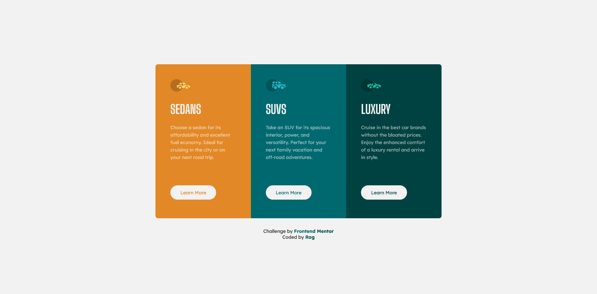
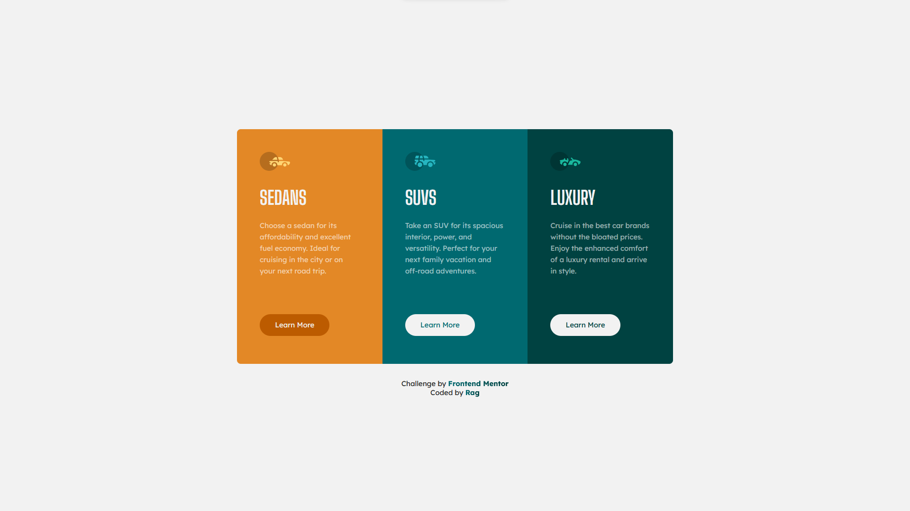

# Frontend Mentor - 3-column preview card component solution

This is a solution to the [3-column preview card component challenge on Frontend Mentor](https://www.frontendmentor.io/challenges/3column-preview-card-component-pH92eAR2-). Frontend Mentor challenges help you improve your coding skills by building realistic projects. 

## Table of contents

- [Overview](#overview)
  - [The challenge](#the-challenge)
  - [Screenshots](#screenshots)
  - [Links](#links)
- [My process](#my-process)
  - [Built with](#built-with)
  - [What I learned](#what-i-learned)
  - [Useful resources](#useful-resources)
- [Author](#author)
- [Acknowledgments](#acknowledgments)

## Overview

### The challenge

Users should be able to:

- View the optimal layout depending on their device's screen size
- See hover states for interactive elements

### Screenshots

- Desktop Site:



- Mobile Site:


- Hover & Focus States:



### Links

- [Solution](https://github.com/ragonscreen/frontend-mentor-3-column-preview-card-component)
- [Live Site](https://your-live-site-url.com)

## My process

### Built with

- Semantic HTML5 markup
- CSS custom properties
- CSS Grid
- Mobile-first workflow

### What I learned

A great way to make responsive layouts with CSS Grid without having to worry, is using `grid-template-areas`. Laying them out top to bottom on mobile devices and automatically switching it to side-by-side is really easy.

```html
<div class="wrapper">
  <div class="section-1"></div>
  <div class="section-2"></div>
  <div class="section-3"></div>
</div>
```

```css
.wrapper {
  display: grid;
  grid-template-areas:
    'section-1'
    'section-2'
    'section-3';
}

.section-1 {
  grid-area: section-1;
}

.section-2 {
  grid-area: section-2;
}

.section-3 {
  grid-area: section-3;
}

@media screen and (min-width: 1000px) {
  .wrapper {
    grid-template-areas: 'section-1 section-2 section-3';
  }
}
```

### Useful resources

- [Kevin Powell - Why CSS grid-area is the best property for laying out content](https://www.youtube.com/watch?v=duH4DLq5yoo) - A great video on why Grid Area is the way to go for responsive layouts without any hassle.

## Author

- Frontend Mentor - [@ragonscreen](https://www.frontendmentor.io/profile/ragonscreen)

## Acknowledgments

- As always, I would like to thank [Kevin Powell](https://www.youtube.com/@KevinPowell) for introducing me to Frontend Mentor and his other awesome CSS guides.
